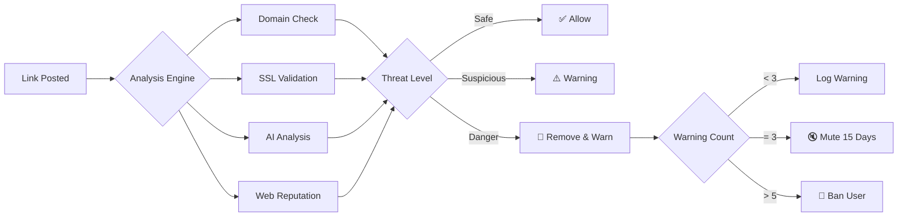

# 🛡️ Discord Link Guardian Bot

<div align="center">
  
  
  <h3>🔒 Advanced AI-Powered Link Security for Discord Servers</h3>
  
  <p>
    <strong>Protect your Discord community from phishing, crypto scams, and malicious links with intelligent real-time analysis</strong>
  </p>

  <!-- Badges -->
  <p>
    
    
    
    
  </p>

  <p>
    
    
    
    
    
    
  </p>

  <p>
    <a href="#-features">Features</a> •
    <a href="#-quick-start">Quick Start</a> •
    <a href="#-installation">Installation</a> •
    <a href="#-configuration">Configuration</a> •
    <a href="#-usage">Usage</a> •
    <a href="#-ai-providers">AI Providers</a> •
    <a href="#-contributing">Contributing</a>
  </p>
</div>

---

## 🌟 Features

<table>
<tr>
<td width="50%">

### 🤖 **AI-Powered Analysis**
- 🧠 **Multiple AI Provider Support** (OpenAI, Anthropic, Local LLMs)
- 🔍 **Content Analysis** for phishing detection
- 📊 **Reputation Scoring** from web searches
- 🎯 **Smart Threat Classification**

### 🛡️ **Security Checks**
- 🔐 **SSL Certificate Validation**
- 📅 **Domain Age Verification**
- 🌐 **Blacklist Database Checking**
- 🔗 **URL Shortener Resolution**
- 🎭 **Homograph Attack Detection**

</td>
<td width="50%">

### ⚡ **Automated Moderation**
- ⚠️ **3-Strike Warning System**
- 🔇 **Auto-mute** (15 days) after warnings
- 🔨 **Permanent Ban** for repeat offenders
- 👮 **Admin Notifications** for threats

### 🐳 **Easy Deployment**
- 📦 **100% Dockerized**
- 🚀 **Interactive Installer Script**
- 🔧 **Auto-dependency Management**
- 📝 **Comprehensive Logging**

</td>
</tr>
</table>

---

## 🚀 Quick Start

```bash
# Clone the repository
git clone https://github.com/xtoor/discord-link-guardian.git
cd discord-link-guardian

# Run the interactive installer
sudo chmod +x installer.sh
sudo ./installer.sh

# Follow the prompts to configure your bot
```

---

## 📋 Prerequisites

<div align="center">
<table>
<tr>
<td align="center">

<br>Ubuntu 20.04+
</td>
<td align="center">

<br>Docker 20.10+
</td>
<td align="center">

<br>Python 3.11+
</td>
<td align="center">

<br>Discord Bot Token
</td>
</tr>
</table>
</div>

---

## 🔧 Installation

### Option 1: Automated Installation (Recommended) 🎯

```bash
# Download and run the installer
wget https://raw.githubusercontent.com/xtoor/discord-link-guardian/main/installer.sh
sudo chmod +x installer.sh
sudo ./installer.sh
```

The installer will:
- ✅ Check system compatibility
- ✅ Install Docker & Docker Compose
- ✅ Configure the bot interactively
- ✅ Build Docker images
- ✅ Test the installation
- ✅ Set up systemd service (optional)

### Option 2: Manual Installation 🔨

<details>
<summary><b>Click to expand manual installation steps</b></summary>

#### 1️⃣ **Install Docker**
```bash
# Update package index
sudo apt update

# Install prerequisites
sudo apt install -y ca-certificates curl gnupg lsb-release

# Add Docker's GPG key
sudo mkdir -p /etc/apt/keyrings
curl -fsSL https://download.docker.com/linux/ubuntu/gpg | sudo gpg --dearmor -o /etc/apt/keyrings/docker.gpg

# Set up repository
echo "deb [arch=$(dpkg --print-architecture) signed-by=/etc/apt/keyrings/docker.gpg] https://download.docker.com/linux/ubuntu $(lsb_release -cs) stable" | sudo tee /etc/apt/sources.list.d/docker.list > /dev/null

# Install Docker
sudo apt update
sudo apt install -y docker-ce docker-ce-cli containerd.io docker-buildx-plugin docker-compose-plugin
```

#### 2️⃣ **Clone Repository**
```bash
git clone https://github.com/yourusername/discord-link-guardian.git
cd discord-link-guardian
```

#### 3️⃣ **Configure Environment**
```bash
# Copy example environment file
cp .env.example .env

# Edit with your settings
nano .env
```

#### 4️⃣ **Build and Run**
```bash
# Build Docker image
docker build -t discord-link-guardian -f docker/Dockerfile .

# Start the bot
docker-compose -f docker/docker-compose.yml up -d
```

</details>

---

## ⚙️ Configuration

### 🔑 Environment Variables

Create a `.env` file in the project root:

```env
# Discord Configuration
DISCORD_TOKEN=your_bot_token_here

# AI Provider (choose one)
OPENAI_API_KEY=your_openai_key      # For ChatGPT
ANTHROPIC_API_KEY=your_claude_key   # For Claude
LOCAL_MODEL=llama2                   # For Ollama

# Search API (optional but recommended)
SEARCH_API_KEY=your_serpapi_key     # For web reputation checks
```

### 📝 Configuration File

Edit `configs/config.yaml`:

```yaml
bot:
  prefix: "!"                        # Command prefix
  status: "Protecting your server"   # Bot status message
  
moderation:
  warnings_before_mute: 3            # Warnings before auto-mute
  mute_duration_days: 15             # Mute duration in days
  warnings_before_ban: 5             # Total warnings before ban
  
ai:
  provider: "openai"                 # openai, anthropic, or local
  model: "gpt-4"                     # Model to use
  
security:
  threat_thresholds:
    safe: 0.2                        # Below = safe
    suspicious: 0.5                  # Below = caution
    danger: 0.8                      # Above = danger
```

---

## 🎮 Usage

### 🤖 Bot Commands

| Command | Description | Permission |
|---------|-------------|------------|
| `!warnings [@user]` | Check warnings for a user | Everyone |
| `!unmute @user` | Manually unmute a user | Admin |
| `!linkstats` | View link analysis statistics | Admin |
| `!config` | View current configuration | Admin |
| `!test <url>` | Test a URL without action | Admin |

### 🔍 Link Analysis Process



### 📊 Threat Levels

<table>
<tr>
<th>Level</th>
<th>Score</th>
<th>Action</th>
<th>Description</th>
</tr>
<tr>
<td><b>✅ Safe</b></td>
<td>0.0 - 0.2</td>
<td>Allow</td>
<td>Link appears legitimate</td>
</tr>
<tr>
<td><b>ℹ️ Caution</b></td>
<td>0.2 - 0.5</td>
<td>Info Message</td>
<td>Limited information available</td>
</tr>
<tr>
<td><b>⚠️ Suspicious</b></td>
<td>0.5 - 0.8</td>
<td>Public Warning</td>
<td>Potential threat detected</td>
</tr>
<tr>
<td><b>🚫 Danger</b></td>
<td>0.8 - 1.0</td>
<td>Remove & Warn</td>
<td>High confidence threat</td>
</tr>
</table>

---

## 🧠 AI Providers

### OpenAI (ChatGPT) 🤖
```yaml
ai:
  provider: "openai"
  model: "gpt-4"  # or gpt-3.5-turbo
```

### Anthropic (Claude) 🎭
```yaml
ai:
  provider: "anthropic"
  model: "claude-3-opus-20240229"
```

### Local LLM (Ollama) 🏠
```yaml
ai:
  provider: "local"
  model: "llama2"  # or mistral, codellama, etc.
```

<details>
<summary><b>Setting up Ollama for Local AI</b></summary>

```bash
# Install Ollama
curl -fsSL https://ollama.ai/install.sh | sh

# Pull a model
ollama pull llama2

# The installer will handle the rest!
```

</details>

---

## 📁 Project Structure

```
discord-link-guardian/
│
├── 🐳 docker/
│   ├── Dockerfile              # Container configuration
│   └── docker-compose.yml      # Service orchestration
│
├── 🤖 src/
│   ├── bot.py                 # Main bot logic
│   ├── link_analyzer.py       # URL analysis engine
│   ├── ai_analyzer.py         # AI integration
│   ├── moderation.py          # User moderation system
│   ├── database.py            # SQLite database handler
│   └── config.py              # Configuration manager
│
├── ⚙️ configs/
│   ├── config.yaml            # Bot configuration
│   └── blacklists/            # Domain blacklists
│
├── 📊 data/
│   └── bot.db                 # SQLite database
│
├── 📝 logs/
│   └── bot.log                # Application logs
│
├── 📚 docs/
│   ├── API.md                 # API documentation
│   └── CONTRIBUTING.md        # Contribution guidelines
│
├── 🔧 scripts/
│   ├── installer.sh           # Interactive installer
│   └── update.sh              # Update script
│
├── 📋 requirements.txt        # Python dependencies
├── 🔑 .env.example           # Environment template
├── 📜 LICENSE                # MIT License
└── 📖 README.md              # This file
```

---

## 🐳 Docker Management

### 🎯 Common Commands

```bash
# Start the bot
docker-compose up -d

# View logs
docker logs -f discord-link-guardian

# Stop the bot
docker-compose down

# Restart the bot
docker-compose restart

# Update and rebuild
git pull
docker-compose build
docker-compose up -d

# View resource usage
docker stats discord-link-guardian
```

### 🔄 Auto-restart with Systemd

```bash
# Enable auto-start on boot
sudo systemctl enable discord-link-guardian

# Service management
sudo systemctl start discord-link-guardian
sudo systemctl stop discord-link-guardian
sudo systemctl status discord-link-guardian

# View logs
journalctl -u discord-link-guardian -f
```

---

## 🔒 Security Features

<table>
<tr>
<td>

### 🛡️ **Domain Analysis**
- ✅ Reputation checking
- ✅ Age verification
- ✅ SSL/TLS validation
- ✅ WHOIS lookup

</td>
<td>

### 🔍 **Pattern Detection**
- ✅ Phishing patterns
- ✅ URL shorteners
- ✅ Suspicious TLDs
- ✅ Homograph attacks

</td>
<td>

### 🤖 **AI Detection**
- ✅ Content analysis
- ✅ Scam detection
- ✅ Credential harvesting
- ✅ Social engineering

</td>
</tr>
</table>

---

## 📈 Monitoring & Analytics

### 📊 Dashboard Metrics

The bot tracks and logs:
- 📌 Total links analyzed
- ⚠️ Threats detected
- 👥 Users warned/muted/banned
- 📈 Detection accuracy
- 🕐 Response times

### 📝 Log Files

```bash
# View real-time logs
tail -f logs/bot.log

# Search for specific events
grep "THREAT" logs/bot.log
grep "WARNING" logs/bot.log

# View Docker logs
docker logs discord-link-guardian --tail 100 -f
```

---

## 🤝 Contributing

We welcome contributions! Please see our [Contributing Guidelines](CONTRIBUTING.md) for details.

### 🐛 Found a Bug?

1. Check [existing issues](https://github.com/yourusername/discord-link-guardian/issues)
2. Create a new issue with:
   - Clear description
   - Steps to reproduce
   - Expected behavior
   - Logs/screenshots

### 💡 Feature Requests

Open an issue with the `enhancement` label!

### 🔧 Pull Requests

1. Fork the repository
2. Create your feature branch (`git checkout -b feature/AmazingFeature`)
3. Commit your changes (`git commit -m 'Add some AmazingFeature'`)
4. Push to the branch (`git push origin feature/AmazingFeature`)
5. Open a Pull Request

---

## 📜 License

This project is licensed under the MIT License - see the [LICENSE](LICENSE) file for details.

```
MIT License

Copyright (c) 2024 Discord Link Guardian

Permission is hereby granted, free of charge, to any person obtaining a copy
of this software and associated documentation files (the "Software"), to deal
in the Software without restriction, including without limitation the rights
to use, copy, modify, merge, publish, distribute, sublicense, and/or sell
copies of the Software, and to permit persons to whom the Software is
furnished to do so, subject to the following conditions:

The above copyright notice and this permission notice shall be included in all
copies or substantial portions of the Software.

THE SOFTWARE IS PROVIDED "AS IS", WITHOUT WARRANTY OF ANY KIND, EXPRESS OR
IMPLIED, INCLUDING BUT NOT LIMITED TO THE WARRANTIES OF MERCHANTABILITY,
FITNESS FOR A PARTICULAR PURPOSE AND NONINFRINGEMENT. IN NO EVENT SHALL THE
AUTHORS OR COPYRIGHT HOLDERS BE LIABLE FOR ANY CLAIM, DAMAGES OR OTHER
LIABILITY, WHETHER IN AN ACTION OF CONTRACT, TORT OR OTHERWISE, ARISING FROM,
OUT OF OR IN CONNECTION WITH THE SOFTWARE OR THE USE OR OTHER DEALINGS IN THE
SOFTWARE.
```

---

## 🌟 Star History

[](https://star-history.com/#xtoor/discord-link-guardian&Date)

---

## 👥 Support

<div align="center">

### Need Help? 💬

<p>
<a href="https://discord.gg/ZzJwbFswHz">
  
</a>
<a href="https://github.com/xtoor/discord-link-guardian/issues">
  
</a>
<a href="mailto:support@yourdomain.com">
  
</a>
</p>

### Acknowledgments 🙏

- [Discord.py](https://discordpy.readthedocs.io/) - Discord API wrapper
- [OpenAI](https://openai.com/) - AI analysis capabilities
- [Docker](https://www.docker.com/) - Containerization platform
- [Contributors](https://github.com/xtoor/discord-link-guardian/graphs/contributors) - Amazing community

---

<p align="center">
  <b>Made with ❤️ by the Discord Link Guardian Team</b>
  <br>
  <i>Keeping Discord communities safe, one link at a time</i>
</p>

<p align="center">
  
  
</p>

</div>
